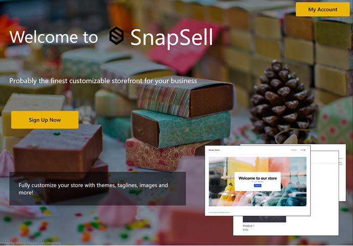

## SnapSell
An eCommerce store builder, allowing users to a online store, manage products, customize their storefront and accept payments for orders.

  

 

## Features
**[Admin]**
- User authentication
- Customize store logo, hero image, color theme
- Show order list, order details
- Search product
- Add/Edit product detail

**[Storefront]**
- Show product list, product details
- Add to cart
- Checkout - payment

## Installation
`npm i` in root folders

## Running locally
- App : `npm run dev`
- Prisma Studio: `npx prisma studio` (in /packages/database)
- Seed data : `npm run seed`(in /packages/database)

## Set up .env files - (env-examples provided in relevant folders)
- /packages/database
- /apps/admin
- /apps/storefront

## Icons & Components
- https://heroicons.com : use this site to find icons if needed.
- https://ui.shadcn.com/docs/primitives/accordion : component design convention

## Tech stack

- Typescript, React, NextJS, Turborepo, Tanstack Query
- Shadcn/ui, React Hot Toast, Zod, AuthJS, Cloudinary, Stripe
- Database: PostgreSQL, Prisma
- Testing/CI: Cypress, GitHub Actions
